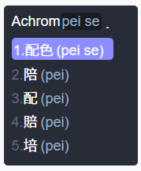
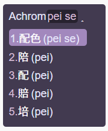
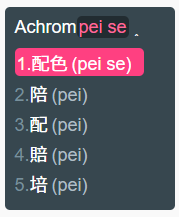

# RIME-style

自用 RIME 配色方案。
添加 `4o` 前缀是为了让自定义方案在设定页面中置顶【。

## 使用

复制对应配色的 yaml 文件内容至「用户文件夹」的 `weasel.custom.yaml` 中 `patch:` 配置项下。

当操作正确时看起来应该是这样的：

```yaml
patch:
  "preset_color_schemes/4o-mast-dark":
    author: "4o, based on Mastodon theme dark"
    back_color: 0x372C28
    border_color: 0x372C28
    candidate_text_color: 0xFFFFFF
    comment_text_color: 0xC8AE9B
    hilited_back_color: 0x221B19
    hilited_candidate_back_color: 0xFF8D8C
    hilited_candidate_label_color: 0xFFFFFF
    hilited_candidate_text_color: 0xFFFFFF
    hilited_comment_text_color: 0xFFFFFF
    hilited_text_color: 0xC8AE9B
    label_color: 0x846960
    name: "毛象 / 暗色"
    text_color: 0xFFFFFF
```

保存后重新部署即可在「输入法设定」页面中选择相应的配色方案。

## 在输入法设定页面添加预览图

将 `preview` 文件夹下的对应图片添加至「程序文件夹」的 `\data\preview` 目录下。

Ps. 似乎需要管理员权限才可以操作。

## 样式预览

### Mastodon-暗色主题



配色方案参考：Mastodon 暗色主题（默认）

### Mastodon-WitchesTown



配色方案参考：Mastodon 主题 [witches-town](https://github.com/Sylvhem/witches-town-theme)

### Mastodon-SleepingTown



配色方案参考：Mastodon 主题 sleeping-town